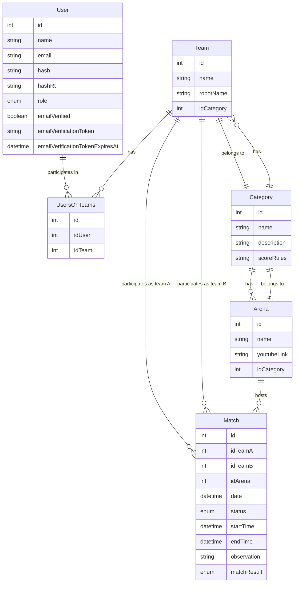

# Robotics Championship Manager

[](https://nestjs.com/) [](https://www.typescriptlang.org/) [](https://www.prisma.io/) [](https://www.postgresql.org/) [](https://www.docker.com/) [](https://jestjs.io/)

## 📑 Table of Contents
- [Robotics Championship Manager](#robotics-championship-manager)
  - [📑 Table of Contents](#-table-of-contents)
  - [🎯 About the Project](#-about-the-project)
  - [🏗️ Architecture](#️-architecture)
  - [🛠️ Technologies](#️-technologies)
    - [Core](#core)
    - [Authentication and Security](#authentication-and-security)
    - [Testing](#testing)
    - [DevOps](#devops)
  - [📊 Data Modeling](#-data-modeling)
  - [🔐 Authentication and Authorization](#-authentication-and-authorization)
    - [Authentication Strategy](#authentication-strategy)
    - [Access Levels](#access-levels)
  - [🌐 API Endpoints](#-api-endpoints)
    - [Authentication](#authentication)
    - [Users](#users)
    - [Teams](#teams)
    - [Matches](#matches)
    - [Arenas](#arenas)
    - [Categories](#categories)
  - [💻 Installation](#-installation)
  - [🚀 Development](#-development)
    - [Available Commands](#available-commands)
  - [🧪 Testing](#-testing)
    - [Running Tests](#running-tests)
  - [🐳 Docker](#-docker)
  - [📝 License](#-license)

## 🎯 About the Project

The Robotics Championship Manager is a system developed as a Final Year Project (TCC) with practical application in the National Robotics Championship. The backend was designed to provide a robust and scalable foundation for managing robotics competitions, offering essential features for organization, monitoring, and analysis of championships. The system will be used in the 2025 National Robotics Championship in Brazil, serving as the official platform for managing all aspects of the competition.

## 🏗️ Architecture

The project follows Clean Architecture principles and is structured in layers:

```
src/
├── auth/           # Authentication and authorization
├── user/           # User management
├── team/           # Team management
├── match/          # Match management
├── arena/          # Arena management
├── category/       # Competition categories
├── email/          # Email service
└── prisma/         # ORM configuration
```

Each module follows the NestJS architecture pattern:
- Controllers: API endpoints
- Services: Business logic
- DTOs: Data validation
- Entities: Data models
- Guards: Route protection
- Decorators: Metadata and validations

## 🛠️ Technologies

### Core
- **NestJS**: Node.js framework for building scalable server-side applications
- **TypeScript**: JavaScript superset with static typing
- **Prisma**: Modern ORM with type-safety
- **PostgreSQL**: Robust relational database

### Authentication and Security
- **JWT**: Token-based authentication
- **Argon2**: Secure password hashing
- **Class Validator**: DTO validation
- **Class Transformer**: Object transformation

### Testing
- **Jest**: Testing framework
- **Supertest**: HTTP integration testing

### DevOps
- **Docker**: Containerization
- **GitHub Actions**: CI
  - Automated test execution

## 📊 Data Modeling

The system uses a relational data model with the following main entities:



## 🔐 Authentication and Authorization

### Authentication Strategy
- JWT (JSON Web Tokens) based authentication
- Refresh tokens for automatic renewal
- Email verification tokens
- Password recovery tokens

### Access Levels

The system has five access levels:

1. **Super Administrator (SUPER_ADMIN)**
   - Full system access
   - Administrator management
   - System configuration

2. **Administrator (ADMIN)**
   - Complete system management
   - Championship creation and editing
   - User and team management
   - Access to all features

3. **Judge (JUDGE)**
   - Match evaluation
   - Result recording
   - Statistics viewing
   - Arena management

4. **Assistant (ASSISTANT)**
   - Organization support
   - Basic information recording
   - Limited viewing

5. **User (USER)**
   - Team creation and management
   - Championship participation
   - Result viewing
   - Personal profile

## 🌐 API Endpoints

### Authentication
```http
POST /auth/signup
POST /auth/signin
POST /auth/refresh
POST /auth/logout
POST /auth/verify-email
POST /auth/request-email-verification
POST /auth/forgot-password
POST /auth/reset-password
```

### Users
```http
GET /users
GET /users/:id
PATCH /users/:id
DELETE /users/:id
PATCH /users/:id/role
PATCH /users/:id/transfer-super-admin
```

### Teams
```http
GET /teams
POST /teams
GET /teams/:id
PATCH /teams/:id
DELETE /teams/:id
```

### Matches
```http
GET /matches
POST /matches
GET /matches/:id
PATCH /matches/:id
DELETE /matches/:id
POST /matches/:id/start
POST /matches/:id/end
POST /matches/:id/result
```

### Arenas
```http
GET /arenas
POST /arenas
GET /arenas/:id
PATCH /arenas/:id
DELETE /arenas/:id
```

### Categories
```http
GET /categories
POST /categories
GET /categories/:id
PATCH /categories/:id
DELETE /categories/:id
```

## 💻 Installation

1. Clone the repository:
```bash
git clone https://github.com/seu-usuario/robotics-championship-manager.git
cd robotics-championship-manager/backend
```

2. Install dependencies:
```bash
yarn install
```

3. Configure environment variables:
```bash
cp .env.example .env
```

4. Start PostgreSQL container:
```bash
yarn db:dev:up
```

5. Run migrations:
```bash
yarn db:migrate:dev
```

6. Start the server:
```bash
yarn start:dev
```

## 🚀 Development

### Available Commands
```bash
# Development
yarn start:dev

# Build
yarn build

# Production
yarn start:prod

# Linting
yarn lint

# Formatting
yarn format

# Database
yarn db:dev:up        # Start PostgreSQL container
yarn db:dev:down      # Stop PostgreSQL container
yarn db:migrate:dev   # Run migrations
yarn db:studio        # Open Prisma Studio
yarn db:generate      # Generate Prisma client
```

## 🧪 Testing

### Running Tests
```bash
# Unit tests
yarn test

# E2E tests
yarn test:e2e

# Coverage
yarn test:cov
```

## 🐳 Docker

The project includes Docker configuration for development and production:

```bash
# Development
yarn db:dev:up

# Production
yarn build
docker build -t robotics-championship-manager .
docker run -p 3000:3000 robotics-championship-manager
```

## 📝 License

This project is under the MIT license. See the [LICENSE](LICENSE) file for more details.
