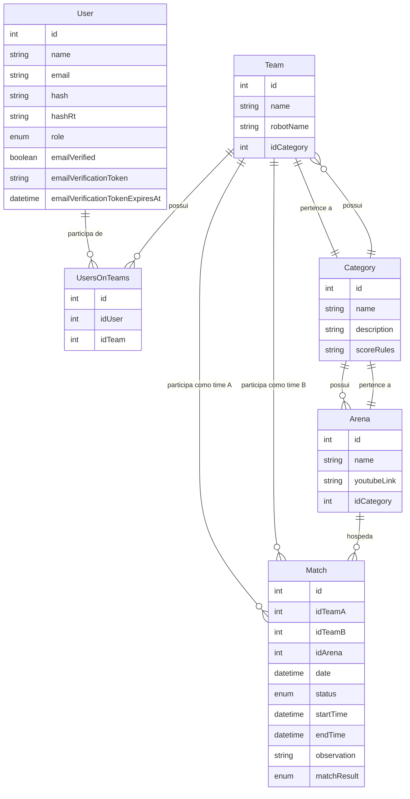

# Gerenciador de Campeonatos de Robótica

[](https://nestjs.com/) [](https://www.typescriptlang.org/) [](https://www.prisma.io/) [](https://www.postgresql.org/) [](https://www.docker.com/) [](https://jestjs.io/)

## 📑 Índice
- [Gerenciador de Campeonatos de Robótica](#gerenciador-de-campeonatos-de-robótica)
  - [📑 Índice](#-índice)
  - [🎯 Sobre o Projeto](#-sobre-o-projeto)
  - [🏗️ Arquitetura](#️-arquitetura)
  - [🛠️ Tecnologias](#️-tecnologias)
    - [Core](#core)
    - [Autenticação e Segurança](#autenticação-e-segurança)
    - [Testes](#testes)
    - [DevOps](#devops)
  - [📊 Modelagem de Dados](#-modelagem-de-dados)
  - [🔐 Autenticação e Autorização](#-autenticação-e-autorização)
    - [Estratégia de Autenticação](#estratégia-de-autenticação)
    - [Níveis de Acesso](#níveis-de-acesso)
  - [🌐 Endpoints da API](#-endpoints-da-api)
    - [Autenticação](#autenticação)
    - [Usuários](#usuários)
    - [Equipes](#equipes)
    - [Partidas](#partidas)
    - [Arenas](#arenas)
    - [Categorias](#categorias)
  - [💻 Instalação](#-instalação)
  - [🚀 Desenvolvimento](#-desenvolvimento)
    - [Comandos Disponíveis](#comandos-disponíveis)
  - [🧪 Testes](#-testes)
    - [Executando Testes](#executando-testes)
  - [🐳 Docker](#-docker)
  - [📝 Licença](#-licença)

## 🎯 Sobre o Projeto

O Gerenciador de Campeonatos de Robótica é um sistema desenvolvido como Trabalho de Conclusão de Curso (TCC) com aplicação prática no Campeonato Nacional de Robótica. O backend foi projetado para fornecer uma base robusta e escalável para gerenciamento de competições de robótica, oferecendo funcionalidades essenciais para organização, acompanhamento e análise de campeonatos. O sistema será utilizado no Campeonato Nacional de Robótica de 2025 no Brasil, servindo como plataforma oficial para gerenciamento de todos os aspectos da competição.

## 🏗️ Arquitetura

O projeto segue os princípios da arquitetura limpa (Clean Architecture) e é estruturado em camadas:

```
src/
├── auth/           # Autenticação e autorização
├── user/           # Gerenciamento de usuários
├── team/           # Gerenciamento de equipes
├── match/          # Gerenciamento de partidas
├── arena/          # Gerenciamento de arenas
├── category/       # Categorias de competição
├── email/          # Serviço de email
└── prisma/         # Configuração do ORM
```

Cada módulo segue o padrão de arquitetura do NestJS:
- Controllers: Endpoints da API
- Services: Lógica de negócios
- DTOs: Validação de dados
- Entities: Modelos de dados
- Guards: Proteção de rotas
- Decorators: Metadados e validações

## 🛠️ Tecnologias

### Core
- **NestJS**: Framework Node.js para construção de aplicações server-side escaláveis
- **TypeScript**: Superset JavaScript com tipagem estática
- **Prisma**: ORM moderno com type-safety
- **PostgreSQL**: Banco de dados relacional robusto

### Autenticação e Segurança
- **JWT**: Autenticação baseada em tokens
- **Argon2**: Hash seguro de senhas
- **Class Validator**: Validação de DTOs
- **Class Transformer**: Transformação de objetos

### Testes
- **Jest**: Framework de testes
- **Supertest**: Testes de integração HTTP

### DevOps
- **Docker**: Containerização
- **GitHub Actions**: CI
  - Execução automática de testes

## 📊 Modelagem de Dados

O sistema utiliza um modelo de dados relacional com as seguintes entidades principais:



## 🔐 Autenticação e Autorização

### Estratégia de Autenticação
- Autenticação baseada em JWT (JSON Web Tokens)
- Refresh tokens para renovação automática
- Tokens de verificação de email
- Tokens de recuperação de senha

### Níveis de Acesso

O sistema possui cinco níveis de acesso:

1. **Super Administrador (SUPER_ADMIN)**
   - Acesso total ao sistema
   - Gerenciamento de administradores
   - Configurações do sistema

2. **Administrador (ADMIN)**
   - Gerenciamento completo do sistema
   - Criação e edição de campeonatos
   - Gerenciamento de usuários e equipes
   - Acesso a todas as funcionalidades

3. **Juiz (JUDGE)**
   - Avaliação de partidas
   - Registro de resultados
   - Visualização de estatísticas
   - Gerenciamento de arenas

4. **Assistente (ASSISTANT)**
   - Apoio na organização
   - Registro de informações básicas
   - Visualização limitada

5. **Usuário (USER)**
   - Criação e gerenciamento de equipes
   - Participação em campeonatos
   - Visualização de resultados
   - Perfil pessoal

## 🌐 Endpoints da API

### Autenticação
```http
POST /auth/signup
POST /auth/signin
POST /auth/refresh
POST /auth/logout
POST /auth/verify-email
POST /auth/request-email-verification
POST /auth/forgot-password
POST /auth/reset-password
```

### Usuários
```http
GET /users
GET /users/:id
PATCH /users/:id
DELETE /users/:id
PATCH /users/:id/role
PATCH /users/:id/transfer-super-admin
```

### Equipes
```http
GET /teams
POST /teams
GET /teams/:id
PATCH /teams/:id
DELETE /teams/:id
```

### Partidas
```http
GET /matches
POST /matches
GET /matches/:id
PATCH /matches/:id
DELETE /matches/:id
POST /matches/:id/start
POST /matches/:id/end
POST /matches/:id/result
```

### Arenas
```http
GET /arenas
POST /arenas
GET /arenas/:id
PATCH /arenas/:id
DELETE /arenas/:id
```

### Categorias
```http
GET /categories
POST /categories
GET /categories/:id
PATCH /categories/:id
DELETE /categories/:id
```

## 💻 Instalação

1. Clone o repositório:
```bash
git clone https://github.com/seu-usuario/robotics-championship-manager.git
cd robotics-championship-manager/backend
```

2. Instale as dependências:
```bash
yarn install
```

3. Configure as variáveis de ambiente:
```bash
cp .env.example .env
```

4. Inicie o container do PostgreSQL:
```bash
yarn db:dev:up
```

5. Execute as migrações:
```bash
yarn db:migrate:dev
```

6. Inicie o servidor:
```bash
yarn start:dev
```

## 🚀 Desenvolvimento

### Comandos Disponíveis
```bash
# Desenvolvimento
yarn start:dev

# Build
yarn build

# Produção
yarn start:prod

# Linting
yarn lint

# Formatação
yarn format

# Banco de Dados
yarn db:dev:up        # Inicia o container do PostgreSQL
yarn db:dev:down      # Para o container do PostgreSQL
yarn db:migrate:dev   # Executa as migrações
yarn db:studio        # Abre o Prisma Studio
yarn db:generate      # Gera o cliente Prisma
```

## 🧪 Testes

### Executando Testes
```bash
# Testes unitários
yarn test

# Testes e2e
yarn test:e2e

# Cobertura
yarn test:cov
```

## 🐳 Docker

O projeto inclui configuração Docker para desenvolvimento e produção:

```bash
# Desenvolvimento
yarn db:dev:up

# Produção
yarn build
docker build -t robotics-championship-manager .
docker run -p 3000:3000 robotics-championship-manager
```

## 📝 Licença

Este projeto está sob a licença MIT. Veja o arquivo [LICENSE](LICENSE) para mais detalhes. 